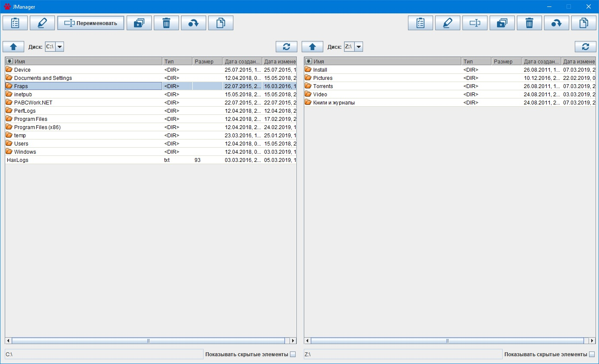
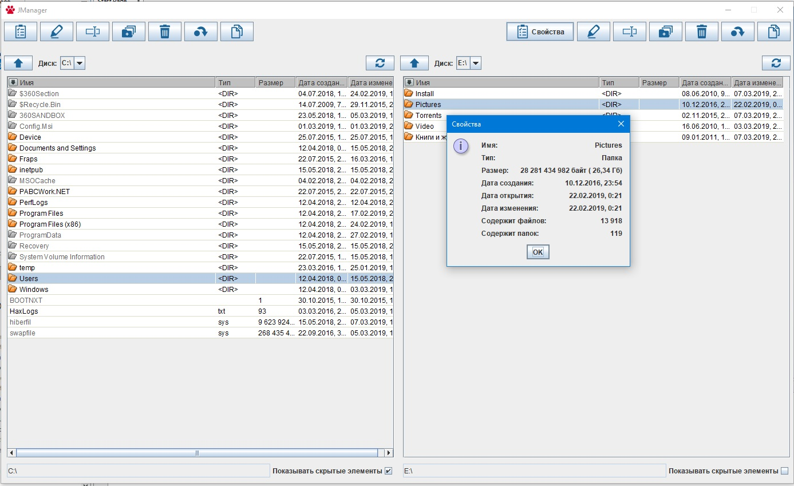
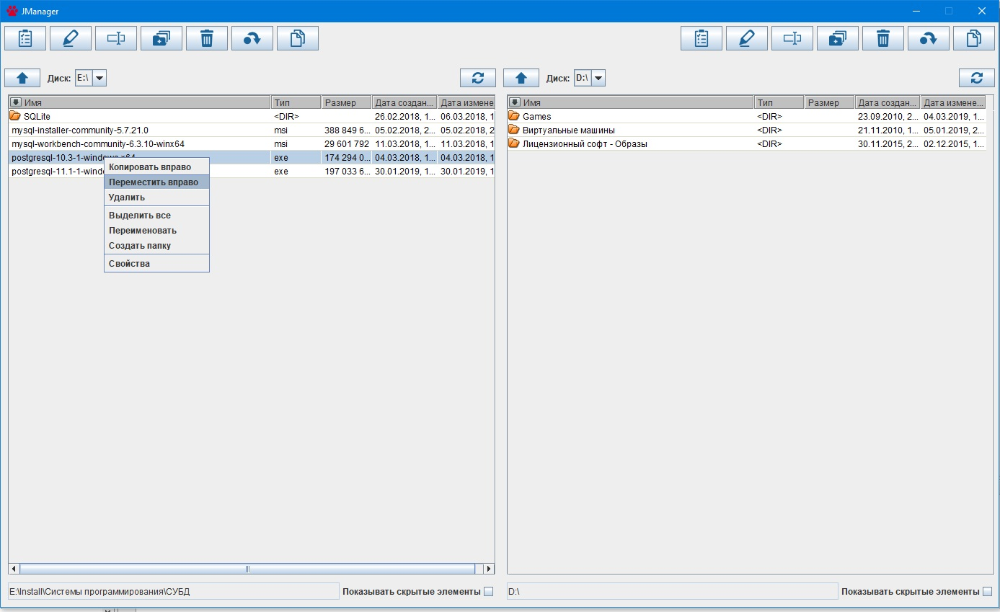
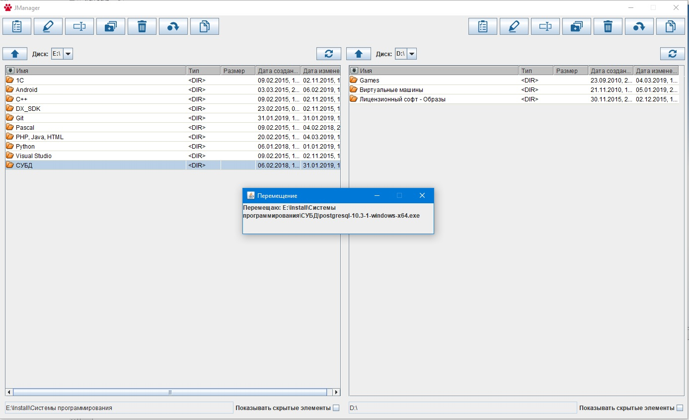

# JManager
Простой двухпанельный файловый менеджер на Java. Первый для меня опыт создания программ такого рода.
Содержит базовый набор возможностей: можно просматривать свойства файлов и папок, создавать новые папки, переименовывать объекты, копировать и перемещать их.

